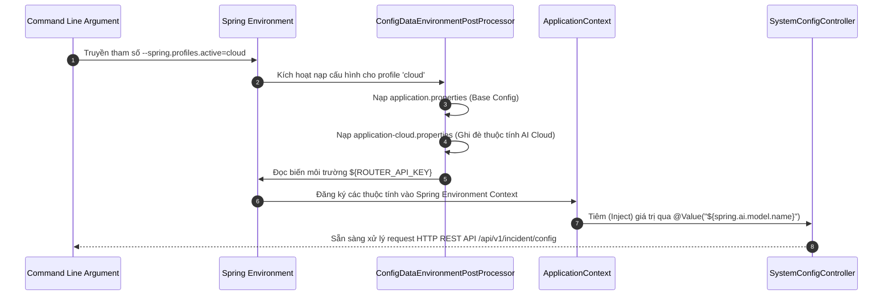

# BÁO CÁO KỸ THUẬT: CƠ CHẾ NẠP PROFILE ĐỘNG TRONG SPRING BOOT
**Hệ thống:** AI Logistics Incident Reporter (Hybrid AI Architecture)  
**Tác giả:** Senior Tech Lead / System Architect  
**Ngày lập:** 18/08/2026  

---

## 1. Bối cảnh & Mục tiêu Kiến trúc (Architectural Context)

Trong dự án **AI Logistics Incident Reporter**, hệ thống đòi hỏi khả năng chuyển đổi linh hoạt giữa hạ tầng AI Cục bộ (Local AI Infrastructure) và hạ tầng AI Đám mây (Cloud AI Aggregator):
- **Môi trường Local (Chạy thử/Phát triển):** Sử dụng mô hình `qwen2.5-coder:7b` chạy qua **Ollama** tại cổng `11434` nhằm tối ưu chi phí, đảm bảo tính riêng tư và bảo mật dữ liệu nội bộ.
- **Môi trường Cloud/Production:** Tự động chuyển đổi sang mô hình `google/gemini-2.5-flash` thông qua cổng **OpenRouter (OpenAI-compatible API)** để đạt hiệu năng xử lý cao và mở rộng linh hoạt.

Yêu cầu kỹ thuật cốt lõi là **"Zero Code Modification"**: Việc chuyển đổi mô hình AI và hạ tầng kết nối phải diễn ra hoàn toàn tự động thông qua cấu hình môi trường mà **không thay đổi bất kỳ dòng mã Java nào**.

---

## 2. Quy trình nạp tệp tin cấu hình (Property Loading Hierarchy)

Spring Boot quản lý cấu hình thông qua cơ chế `Environment` abstraction và chuỗi nạp dữ liệu `ConfigDataEnvironmentPostProcessor`.

### 2.1. Quy tắc đặt tên tệp tin (Naming Conventions)
- **`application.properties`**: Tệp cấu hình gốc (Base Configuration). Chứa các thuộc tính chung cho toàn bộ ứng dụng (`spring.application.name`, `server.port`) và khai báo profile mặc định (`spring.profiles.active=local`).
- **`application-local.properties`**: Tệp cấu hình riêng cho profile `local`. Chứa endpoint Ollama (`http://localhost:11434`) và tên model `qwen2.5-coder:7b`.
- **`application-cloud.properties`**: Tệp cấu hình riêng cho profile `cloud`. Chứa endpoint OpenRouter (`https://openrouter.ai/api/v1`), API Key đọc từ biến môi trường `${ROUTER_API_KEY}` và tên model `google/gemini-2.5-flash`.

### 2.2. Thứ tự ưu tiên nạp thuộc tính (Property Precedence Order)
Spring Boot áp dụng nguyên tắc **"Ghi đè có thứ tự" (Last-one-wins/Override Rule)** theo thứ tự ưu tiên từ cao xuống thấp như sau:

1. **Command-line Arguments:** `--spring.profiles.active=cloud` (Ưu tiên cao nhất).
2. **System Environment Variables:** `SPRING_PROFILES_ACTIVE=cloud` hoặc `${ROUTER_API_KEY}`.
3. **Profile-specific Properties Outside Jar:** Tệp `application-{profile}.properties` bên ngoài tệp đóng gói.
4. **Profile-specific Properties Inside Jar:** Tệp `application-cloud.properties` hoặc `application-local.properties` đóng gói trong `src/main/resources`.
5. **Default Application Properties:** Tệp `application.properties` (Chứa cấu hình fallback mặc định).

```
┌──────────────────────────────────────────────────────────┐
│      1. Command Line Arguments (--spring.profiles.active)│ (Ưu tiên cao nhất)
└────────────────────────────┬─────────────────────────────┘
                             │ Overrides
┌────────────────────────────▼─────────────────────────────┐
│      2. Environment Variables (${ROUTER_API_KEY})        │
└────────────────────────────┬─────────────────────────────┘
                             │ Overrides
┌────────────────────────────▼─────────────────────────────┐
│ 3. Profile Properties (application-cloud.properties)     │
└────────────────────────────┬─────────────────────────────┘
                             │ Overrides
┌────────────────────────────▼─────────────────────────────┐
│ 4. Default Properties (application.properties)            │ (Ưu tiên thấp nhất)
└──────────────────────────────────────────────────────────┘
```

---

## 3. Luồng xử lý chi tiết khi ứng dụng khởi chạy

Khi khởi chạy lệnh:
```bash
java -jar app.jar --spring.profiles.active=cloud
```

Quá trình nạp profile và khởi tạo Bean diễn ra qua 5 bước chính:



### Chi tiết 5 bước thực thi:

1. **Bước 1: Phân tích tham số đầu vào (Parsing Arguments)**
   - Hàm `SpringApplication.run(Application.class, args)` tiếp nhận các tham số dòng lệnh.
   - Spring Boot nhận diện tham số `--spring.profiles.active=cloud` và ghi đè thuộc tính `spring.profiles.active` mặc định trong `application.properties`.

2. **Bước 2: Kích hoạt Profile & Nạp file thuộc tính (Profile Activation & Configuration Loading)**
   - `ConfigDataEnvironmentPostProcessor` được kích hoạt.
   - Đầu tiên, Spring nạp `application.properties` để lấy các thông số cơ bản (`spring.application.name=logistics-incident-reporter`).
   - Tiếp theo, do profile `cloud` đang kích hoạt, Spring tìm và nạp `application-cloud.properties`.
   - Các thuộc tính trùng tên trong `application-cloud.properties` (ví dụ `spring.ai.model.name`) sẽ **ghi đè** hoàn toàn các thuộc tính tương ứng ở tệp mặc định.

3. **Bước 3: Giải mã thuộc tính động & Biến môi trường (Environment Interpolation)**
   - Trong `application-cloud.properties`, thuộc tính `spring.ai.openai.api-key=${ROUTER_API_KEY}` sẽ được Spring `PropertySourcesPropertyResolver` tự động tra cứu từ hệ điều hành.
   - Nếu biến `${ROUTER_API_KEY}` tồn tại trên OS, giá trị thật sẽ được nạp; nếu không, giá trị fallback mặc định sẽ được sử dụng.

4. **Bước 4: Khởi tạo Beans và Inject Thuộc tính (Bean Instantiation & Value Injection)**
   - Spring Container khởi tạo REST Controller `SystemConfigController`.
   - Annotation `@Value("${spring.ai.model.name}")` kích hoạt cơ chế Dependency Injection, rút truy vấn từ `Environment` và gán trực tiếp vào biến `private String modelName`.
   - Đối với các lớp cấu hình Spring AI (`ChatModel`, `OllamaApi`, `OpenAiApi`), nếu sử dụng `@Profile("local")` hoặc `@Profile("cloud")`, Spring IoC container chỉ khởi tạo duy nhất Bean tương ứng với profile đang active.

5. **Bước 5: Đáp ứng Request qua REST Endpoint (Runtime Đối soát)**
   - Khi client gửi GET request đến `/api/v1/incident/config`, `SystemConfigController` đọc trạng thái thực tế từ `Environment.getActiveProfiles()` và các thuộc tính `@Value` đã được tiêm để trả về phản hồi JSON chính xác.

---

## 4. Ưu điểm Kiến trúc & Best Practices

1. **Bảo mật tuyệt đối (Security First):**
   - API Key nhạy cảm (`ROUTER_API_KEY`) không bao giờ được lưu trực tiếp (hardcode) trong mã nguồn hoặc tệp properties. Nạp qua biến môi trường giúp tuân thủ chuẩn **12-Factor App**.
2. **Khả năng bảo trì và linh hoạt (Maintainability & Flexibility):**
   - Việc chuyển từ mô hình chạy local (`qwen2.5-coder:7b`) sang cloud (`google/gemini-2.5-flash`) chỉ đơn giản là đổi tham số khởi chạy, không cần biên dịch lại mã nguồn (Recompilation).
3. **Nguyên lý Đơn trách nhiệm (Single Responsibility Principle - SOLID):**
   - Lớp `SystemConfigController` chịu trách nhiệm duy nhất là phản hồi thông tin đối soát cấu hình hệ thống, không phụ thuộc cứng vào triển khai AI cụ thể.

---
*Báo cáo được khởi tạo tự động bởi Hệ thống Antigravity AI Engine.*
